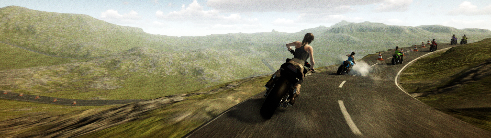

## Motorcycles - [Video](https://youtu.be/omCJTvZ3ZMY)

Reinforcement learning project made with Unity Machine Learning Agents.  
Agents control throttle, steering, front and rear brakes. Observations include the motorcyle state (motor torque, brake torque, steering angle, velocity, angular velocity, inclination), its relative position on the road (distance to ground, forward angle, deviation from center) and a couple of raycasts for obstacle and opponent detection. Agents are rewarded for velocity in road direction and penalized for collisions, veering off the road and for being passed by other motorcyles. The included model was trained with PPO. Significant training progress didn't emerge until around 30M steps and I recommend retraining with at least 50M steps. Cumulative rewards and episode lengths might fluctuate quite a bit.  
  
The project contains a few freely available code libs and 3D models:
  
  
Three Cylinder Naked Street Bike by Jamie Hamel-Smith  
[https://sketchfab.com/3d-models/three-cylinder-naked-street-bike-0897a975845647919728095d117a6255](https://sketchfab.com/3d-models/three-cylinder-naked-street-bike-0897a975845647919728095d117a6255) 
   
Lara Croft by DshGames  
[https://sketchfab.com/3d-models/rottr-laracroft-873f56b896f245428cf296e2dfe351a7](https://sketchfab.com/3d-models/rottr-laracroft-873f56b896f245428cf296e2dfe351a7)  
  
MicroSplat Shader & Terrain by Jason Booth  
[https://assetstore.unity.com/packages/tools/terrain/microsplat-96478](https://assetstore.unity.com/packages/tools/terrain/microsplat-96478)  
  
KSPWheel by [shadowmage45](https://github.com/shadowmage45)  
[https://github.com/shadowmage45/KSPWheel](https://github.com/shadowmage45/KSPWheel)  